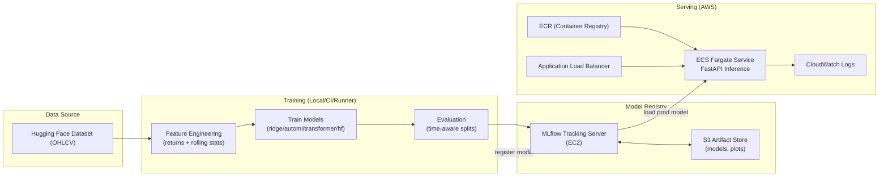
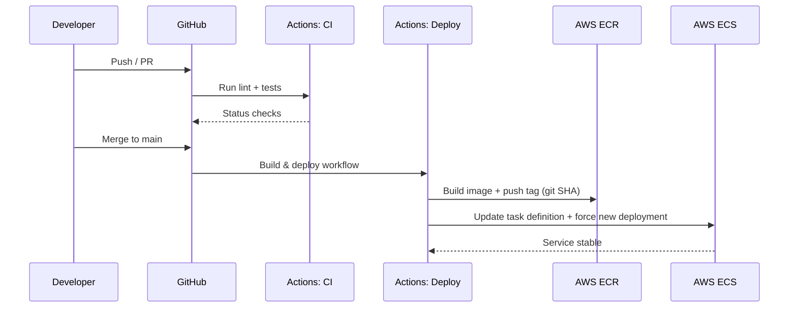

# Stock Price Predictor
**Production-Grade ML Deployment Pipeline with CI/CD, Model Registry, and Cloud Infrastructure**


---

## Overview

**Stock Price Predictor** is a **production-oriented MLOps project** that demonstrates the full ML lifecycle:

- reproducible training
- model registry & versioning (MLflow)
- automated deployment (GitHub Actions → AWS ECS)
- infrastructure as code (Terraform)
- online inference (FastAPI) with health/readiness

The project is scoped to **operational excellence** rather than speculative financial claims. Models forecast **short-horizon returns** and are deployed as a real service.

---

## Key Capabilities

### End-to-End ML Lifecycle
- Offline training with time-aware splits (walk-forward / holdout)
- Centralized **MLflow model registry**
- Model promotion via alias (`prod`)
- Immutable Docker images for inference

### Multi-Model Training (Single Serving Interface)
Train and compare multiple model families under one pipeline:
- **Ridge** (interpretable baseline)
- **AutoML** (FLAML)
- **Custom Transformer** (PyTorch)
- **HF fine-tune** (placeholder until model choice)

All models register under the **same `MODEL_NAME`** and the API always serves **`@prod`**.

---

## Architecture Diagrams

### System Architecture (AWS + MLflow + ECS)



### CI/CD Flow (GitHub Actions → AWS)



---

## Repository Structure

```
stock-price-predictor/
├── src/
│   ├── data/                 # HF loading + feature engineering
│   ├── models/               # ridge / automl / transformer / hf
│   ├── training/             # training entrypoint + dispatch + eval + registry
│   └── serving/              # FastAPI inference service
├── configs/                  # Training configs
├── infra/terraform/          # AWS IaC (MLflow EC2, S3, ECR, ECS, ALB)
├── docker/                   # Dockerfile
├── .github/workflows/        # CI/CD pipelines
├── scripts/                  # Train & promote helpers
├── tests/
├── Makefile
├── requirements.txt
├── LICENSE
└── README.md
```

---

## How to Run (Local)

### 0) Prerequisites

* Python 3.12
* Docker (for container testing)
* (Optional) AWS CLI + Terraform (for cloud deploy)

### 1) Setup

```bash
make setup
make lint
make test
```

### 2) Start MLflow locally (dev mode)

In a new terminal:

```bash
mlflow ui --host 0.0.0.0 --port 5000
```

Set MLflow env vars:

```bash
export MLFLOW_TRACKING_URI=http://127.0.0.1:5000
export MODEL_NAME=stock-price-predictor
export MODEL_ALIAS=prod
```

### 3) Configure training data

Edit `configs/train.yaml`:

* Set `data.hf_dataset_id` to a real HF dataset with columns: `date`, `symbol`, `close`
* Set `data.universe` to a small list of tickers (MVP)

### 4) Train a model and register it

Example (ridge baseline):

```bash
python -m src.training.train --config configs/train.yaml --model_family ridge
```

### 5) Promote a version to production alias (`prod`)

After training prints a registered version (e.g., `12`):

```bash
export MLFLOW_TRACKING_URI=http://127.0.0.1:5000
export MODEL_NAME=stock-price-predictor
export MODEL_ALIAS=prod
./scripts/promote_model.sh 12
```

### 6) Run the API locally

```bash
make serve
```

Check:

* Health: `GET http://127.0.0.1:8000/health`
* Ready:  `GET http://127.0.0.1:8000/ready`

### 7) Call `/predict`

```bash
curl -X POST "http://127.0.0.1:8000/predict" \
  -H "Content-Type: application/json" \
  -d '{
    "symbol":"AAPL",
    "horizon":1,
    "last_close":200.0,
    "last_returns":[0.001,-0.002,0.0005,0.0012,-0.0007,0.0009,0.001,-0.0011,0.0004,0.0015,
                    0.0002,-0.0003,0.0007,0.0011,-0.0008,0.0006,0.0001,-0.001,0.0013,0.0008,
                    -0.0006,0.0009,0.001,-0.0004,0.0002,0.0005,-0.0003,0.0006,0.0001,0.0004]
  }'
```

---

## How to Run (Docker)

Build:

```bash
make docker-build
```

Run:

```bash
docker run -p 8000:8000 \
  -e MLFLOW_TRACKING_URI=http://host.docker.internal:5000 \
  -e MODEL_NAME=stock-price-predictor \
  -e MODEL_ALIAS=prod \
  stock-price-predictor:local
```

---

## How to Deploy (AWS, Terraform)

### 0) Requirements

* Terraform installed
* AWS CLI configured (`aws sts get-caller-identity` works)
* A VPC + subnets available (you will paste IDs into tfvars)

### 1) Provision MLflow EC2 + S3 + ECR + ECS + ALB

```bash
cd infra/terraform/envs/dev
cp terraform.tfvars.example terraform.tfvars
# edit terraform.tfvars with your VPC/subnet IDs and allowed CIDRs

terraform init
terraform fmt
terraform validate
terraform apply
```

Terraform outputs:

* MLflow tracking URI (EC2 public IP)
* S3 artifact bucket name
* ECR repo URL
* ALB DNS name (your public API endpoint)
* ECS cluster + service

### 2) Push your first container image to ECR

```bash
AWS_REGION=us-west-2
ECR_REPO_URL=$(terraform -chdir=infra/terraform/envs/dev output -raw ecr_repo_url)

aws ecr get-login-password --region "$AWS_REGION" \
  | docker login --username AWS --password-stdin "$ECR_REPO_URL"

docker build -f docker/Dockerfile -t "$ECR_REPO_URL:latest" .
docker push "$ECR_REPO_URL:latest"
```

Force ECS to pull the latest image:

```bash
aws ecs update-service \
  --cluster "$(terraform -chdir=infra/terraform/envs/dev output -raw ecs_cluster_name)" \
  --service "$(terraform -chdir=infra/terraform/envs/dev output -raw ecs_service_name)" \
  --force-new-deployment \
  --region "$AWS_REGION"
```

### 3) Verify deployment

Your API endpoint:

```bash
echo "http://$(terraform -chdir=infra/terraform/envs/dev output -raw alb_dns_name)"
```

---

## CI/CD

### CI (Pull Requests)

* ruff lint
* pytest

### CD (Merge to main)

* builds Docker image
* pushes to ECR
* deploys to ECS

You must configure GitHub Secrets for deploy (or upgrade to OIDC later):

* `AWS_ACCESS_KEY_ID`
* `AWS_SECRET_ACCESS_KEY`
* `AWS_ACCOUNT_ID`
* `AWS_REGION`
* `ECR_REPO`
* `ECS_CLUSTER`
* `ECS_SERVICE`

---

## Security Notes

* Do not commit secrets. Use `.env` locally and GitHub Secrets in CI/CD.
* Prefer IAM roles for EC2/ECS runtime access (no long-lived keys).
* Restrict MLflow EC2 inbound (`5000`) to your IP or VPC CIDR.

---

## Disclaimer

For educational and engineering demonstration purposes only.
Not financial advice. No performance guarantees.

---

## License

MIT License. See `LICENSE`.
