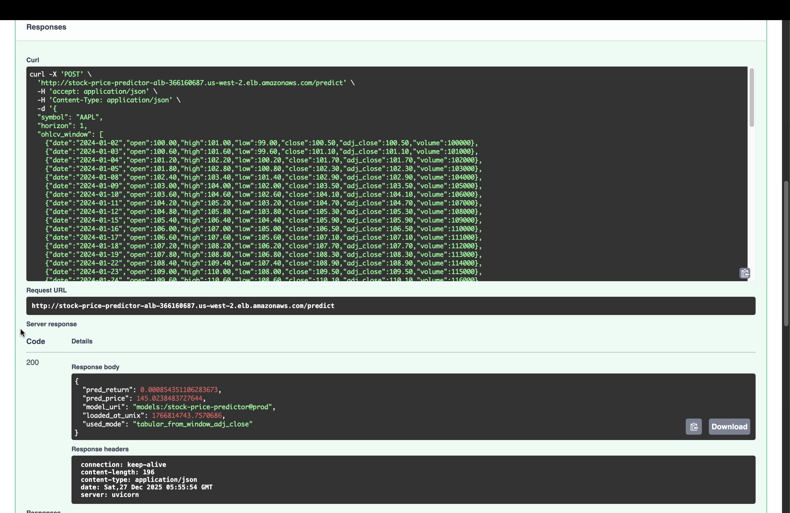
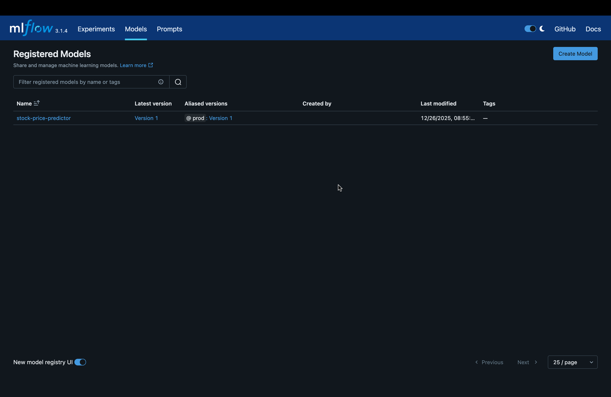
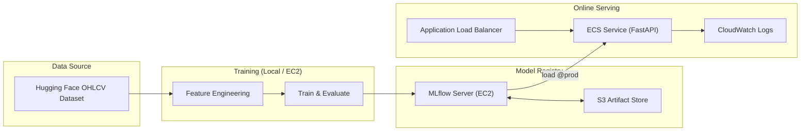

# Stock Price Predictor

**Production-Grade MLOps System with MLflow Registry, AWS Infrastructure, and CI-Validated Serving**


---

## Overview

**Stock Price Predictor** is a **production-style MLOps project** that demonstrates how to **train, register, promote, and serve machine learning models reliably** using modern infrastructure and tooling.

The focus is **operational correctness**, not speculative financial claims:

* reproducible training
* centralized MLflow registry
* alias-based model promotion (`@prod`)
* containerized FastAPI inference
* infrastructure as code (Terraform)
* CI-validated serving paths
* manual, cost-controlled AWS deployment

Models forecast **short-horizon log returns** and are exposed through a real HTTP API behind a load balancer.

---

## Proof of Deployment (Selected Evidence)

The following screenshots demonstrate that the system is fully deployed and operational.

### AWS FastAPI Inference (Live)

- Request routed through **Application Load Balancer**
- **ECS-hosted FastAPI** service responding
- Model loaded from **MLflow registry (`@prod`)**
- End-to-end prediction succeeds



---

### MLflow Model Registry (Production Alias)

- Model registered under a single logical name
- Alias-based promotion (`@prod`) in use
- Serving layer resolves models dynamically via registry



---

## Prerequisites

Local development requires:

* Python **3.11+**
* `make`
* Docker
* Git

AWS deployment additionally requires:

* AWS CLI (configured; `aws sts get-caller-identity` succeeds)
* Terraform **>= 1.5**
* An AWS account with permission to create:

  * EC2
  * ECS
  * ECR
  * ALB
  * S3
  * IAM roles

**No cloud resources are required for local development.**

---

## Initial Setup (One-Time)

Clone the repository and create a virtual environment:

```bash
git clone https://github.com/<your-handle>/stock-price-predictor.git
cd stock-price-predictor

python -m venv .venv
source .venv/bin/activate
pip install -r requirements.txt
```

Verify tooling and environment:

```bash
make lint
make test
```

You are now ready to proceed with either:

* **Runbook A — Local Development & Deployment**, or
* **Runbook B — AWS Production Deployment**

---

## Key Capabilities

### End-to-End ML Lifecycle

* Time-aware training (walk-forward + holdout)
* Centralized **MLflow Tracking Server + Model Registry**
* Explicit promotion via alias (`prod`)
* Immutable Docker images for inference
* One-time model load with in-memory reuse

### Multi-Model Training, Single Serving Interface

The same pipeline supports multiple model families:

* **Ridge Regression** (interpretable baseline)
* **AutoML** (FLAML)
* **Custom Transformer** (PyTorch)
* **HF Foundation Model** (Amazon Chronos: `amazon/chronos-t5-small`)

All models register under a single `MODEL_NAME`.
The API **always serves `models:/<MODEL_NAME>@prod`**.

---

## Architecture

### System Architecture (AWS)



---

## CI vs Deployment Model

### CI (Automatic)

Runs on pull requests and `main`:

* lint (`ruff`)
* tests (`pytest`)
* Docker build
* FastAPI boot + `/ready` smoke test (model load skipped)

CI **never**:

* trains models
* touches MLflow registry
* deploys to AWS

### Deployment (Manual)

* Infrastructure provisioned via **Terraform**
* Models trained **outside CI**
* ECS deployments triggered **manually**
* AWS resources are **not kept running continuously**

This separation avoids unnecessary cloud spend while preserving production realism.

---

## Repository Structure

```
stock-price-predictor/
├── src/
│   ├── data/                 # Dataset loading + feature engineering
│   ├── models/               # Model implementations
│   ├── training/             # Train / evaluate / register
│   └── serving/              # FastAPI inference service
├── configs/                  # Training configs
├── infra/terraform/          # AWS IaC (EC2, S3, ECR, ECS, ALB)
├── docker/                   # Dockerfile
├── .github/workflows/        # CI + manual deploy
├── scripts/                  # Train / promote helpers
├── tests/
├── Makefile
├── requirements.txt
└── README.md
```

---

# Runbooks

This project supports **two fully supported execution paths**:

1. **Local (developer) deployment**
2. **AWS (production-style) deployment**

Both paths are intentionally documented and tested.

---

## Runbook A — Local Development & Deployment

**Purpose:** Fast iteration, debugging, experimentation, CI validation.

### A1. Start MLflow locally

```bash
make mlflow
```

MLflow UI:

```
http://127.0.0.1:5001
```

Set environment variables:

```bash
export MLFLOW_TRACKING_URI=http://127.0.0.1:5001
export MODEL_NAME=stock-price-predictor
export MODEL_ALIAS=prod
```

---

### A2. Train and register a model locally

```bash
PYTHONPATH=. .venv/bin/python \
  -m src.training.train \
  --config configs/train.yaml \
  --model_family ridge
```

This logs parameters, metrics, artifacts, and registers a model version.

---

### A3. Promote a model to `prod`

```bash
./scripts/promote_model.sh <VERSION_NUMBER>
```

---

### A4. Run FastAPI locally

```bash
make serve
```

Verify:

```bash
curl http://127.0.0.1:8000/health
curl http://127.0.0.1:8000/ready
```

---

### A5. Local prediction test

```bash
curl -X POST http://127.0.0.1:8000/predict \
  -H "Content-Type: application/json" \
  -d @examples/sample_request.json
```

---

## Runbook B — AWS Production Deployment

**Purpose:** Demonstrate real cloud deployment and registry-backed serving.

### B1. Provision infrastructure

```bash
cd infra/terraform/envs/dev
terraform init
terraform validate
terraform apply
```

---

### B2. Verify MLflow

```
http://<MLFLOW_EC2_PUBLIC_IP>:5000
```

---

### B3. Train against AWS MLflow

```bash
export MLFLOW_TRACKING_URI=http://<MLFLOW_EC2_PUBLIC_IP>:5000
export MODEL_NAME=stock-price-predictor
```

```bash
PYTHONPATH=. .venv/bin/python \
  -m src.training.train \
  --config configs/train.yaml \
  --model_family ridge
```

---

### B4. Promote to `prod`

```bash
./scripts/promote_model.sh <VERSION_NUMBER>
```

**Mandatory.** ECS will not start without a `prod` alias.

---

### B5. Deploy to ECS

```bash
aws ecs update-service \
  --cluster <ecs-cluster> \
  --service <ecs-service> \
  --force-new-deployment \
  --region <region>
```

---

### B6. Verify deployment

```bash
curl http://<ALB_DNS>/health
curl http://<ALB_DNS>/ready
```

---

## Runbook C — Promote & Redeploy (Production Loop)

1. Train new model
2. Validate metrics in MLflow
3. Promote version to `prod`
4. Force ECS redeploy
5. Verify `/health`, `/ready`, `/predict`

This is the **only supported production update path**.

---

## Runbook D — CI Behavior

CI runs linting, tests, Docker builds, and boot-time smoke tests.

CI **never** trains models, touches the registry, or deploys to AWS.

---

## Runbook E — Cost Control

Stop resources:

```bash
aws ec2 stop-instances --instance-ids <mlflow-instance-id>
aws ecs update-service --desired-count 0
```

Or destroy everything:

```bash
terraform destroy
```

---

## Supported Execution Matrix

| Mode  | Training | Registry        | Serving       | Cost |
| ----- | -------- | --------------- | ------------- | ---- |
| Local | ✅        | Local MLflow    | Local FastAPI | $0   |
| AWS   | ✅        | MLflow EC2 + S3 | ECS + ALB     | $$   |
| CI    | ❌        | ❌               | Smoke only    | $0   |

---

## Security Notes

* No secrets committed
* IAM roles used for EC2/ECS
* Restricted security groups
* No long-lived credentials in containers

---

## Disclaimer

Educational and engineering demonstration only.
Not financial advice.

---

## License

MIT License.

